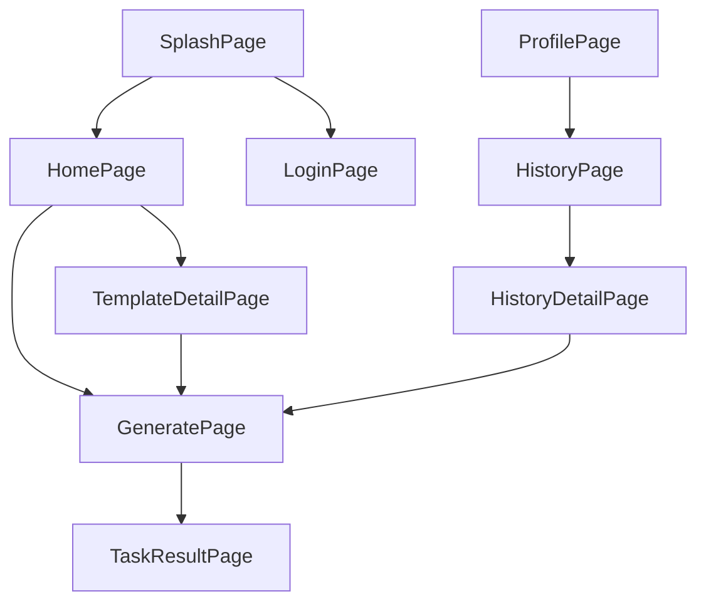
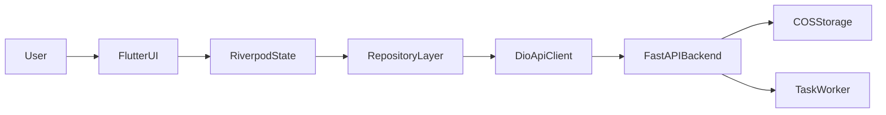

# Banana Flutter App 前端 PRD

> 面向 iOS / Android 的 Flutter App 前端规划文档
> 目标：复用现有 Banana Web 后端能力，快速落地一个移动端精简版 App
> 最后更新：2026-04-26

---

# 一、项目目标

## 1.1 项目背景

当前系统已经具备较完整的 Web 端用户能力与后台能力，核心链路包括：

- 模版浏览
- 文生图 / 图编辑
- 局部重绘
- 提示词反推
- 历史记录
- 积分体系
- 管理后台

现阶段计划新增一个独立的原生移动端 App，使用 `Flutter` 作为跨平台开发框架，优先复用现有 `FastAPI` 后端、任务体系、鉴权体系与对象存储方案，以较低成本补齐移动端入口。

本 PRD 不替代现有 Web PRD，也不替代 `prd-miniapp-frontend.md`。它专门用于指导 **Flutter App 一期产品范围、技术架构、接口复用与实施节奏**。

## 1.2 项目目标

本项目的目标如下：

1. 新建独立的 `Flutter` App 前端项目，不影响当前 `frontend/` Web 项目。
2. 最大化复用现有用户侧后端接口，不对主业务接口做大规模重构。
3. 一期采用 **现有账号体系登录**，即沿用账号/邮箱 + 密码登录，后端继续签发现有 JWT。
4. App 一期定位为 **移动端精简版**，优先跑通高频用户链路，而不是一次性对齐 Web 全量能力。
5. 继续复用现有 **COS 上传、任务轮询、积分扣费、历史记录** 机制。

## 1.3 成功标准

满足以下条件即可视为一期成功上线：

- 用户可在 App 中完成登录
- 用户可浏览模版并进入生成页
- 用户可上传参考图并提交生成任务
- 用户可查看任务进度和结果
- 用户可查看历史记录
- 用户可查看个人积分与基础账户信息
- 后端主业务接口无需大规模重构

---

# 二、产品定位与范围

## 2.1 产品定位

Flutter App 的定位是：

**面向普通用户的移动端 AI 绘图入口**

其核心职责不是承接后台管理能力，也不是照搬 Web 全量复杂交互，而是提供：

- 更适合手机端的生成体验
- 更清晰的结果浏览与保存体验
- 更自然的碎片化使用路径
- 与现有业务系统一致的账户、任务、积分与历史闭环

## 2.2 一期定位

一期采用：

**移动端精简版**

设计原则如下：

1. 只保留高频、低学习成本、移动端易完成的主路径
2. 优先保证“能生成、能看结果、能复用模版、能查看历史”
3. 暂不承接 Web 中交互复杂、维护成本高或移动端价值较低的能力

## 2.3 本期范围

一期纳入范围的功能：

1. 账号密码登录
2. 模版列表与模版详情
3. 文生图 / 图片编辑基础版
4. 参考图上传
5. 任务创建与轮询
6. 历史记录列表与详情
7. 结果图预览与保存
8. 我的页面与积分展示

## 2.4 暂不纳入范围

以下能力不在一期范围内：

1. 后台管理能力迁移
2. 第三方登录
3. 注册流程重构
4. 修改密码
5. 头像上传
6. 提示词反推
7. 局部重绘
8. 复杂图片编辑交互
9. App 内支付 / IAP
10. Push 推送与消息中心

说明：

- 当前后端已支持 `promptReverse` 和 `inpaint`，但它们在移动端交互复杂度更高，一期不建议接入。
- 支付与订阅体系目前并非现有 Web 用户侧主链路，App 一期不引入新商业化复杂度。

---

# 三、现有系统复用策略

## 3.1 可直接复用的后端能力

Flutter App 一期可直接复用以下后端能力：

- `JWT` 登录态
- 用户信息查询
- 模版列表与模版详情
- 任务创建
- 任务结果轮询
- 历史记录查询
- 积分展示
- COS 上传凭证签发
- 图片下载与重新生成

## 3.2 已确认的核心接口

一期可优先复用以下接口：

| 方法 | 路径 | 用途 |
|------|------|------|
| POST | `/api/auth/login` | 登录 |
| GET | `/api/auth/me` | 获取当前用户信息 |
| GET | `/api/auth/credit-logs` | 获取积分流水 |
| GET | `/api/templates` | 模版列表 |
| GET | `/api/templates/tags` | 模版标签 |
| GET | `/api/templates/:id` | 模版详情 |
| GET | `/api/config/task-scenes` | 获取场景、尺寸、分辨率、积分配置 |
| POST | `/api/tasks` | 创建任务 |
| GET | `/api/tasks/:id` | 查询单任务 |
| GET | `/api/tasks?task_ids=1&task_ids=2` | 批量轮询任务 |
| GET | `/api/history` | 获取历史记录 |
| POST | `/api/upload/credential` | 获取 COS 上传凭证 |
| POST | `/api/images/:id/regenerate` | 对结果图重新生成 |
| GET | `/api/images/:id/download` | 通过鉴权下载图片 |

## 3.3 不能直接复用的部分

Flutter App 不会直接复用以下 Web 资产：

- Vue 页面组件
- Ant Design Vue 交互层
- `GenerateView.vue` 内部状态组织方式
- Web 浏览器特有能力，如 `localStorage`、`blob` 下载、DOM 文件输入

这些能力需要在 Flutter 中重实现，但可继续复用：

- 接口路径
- 请求参数结构
- 业务字段含义
- 任务状态机
- 积分和扣费规则

## 3.4 与 Web 保持一致的业务契约

Flutter 一期应遵守以下业务契约：

1. 登录成功后保存后端签发的 JWT
2. 任务创建后通过轮询获取状态，不依赖 WebSocket / SSE
3. 参考图和源图优先走 COS 直传
4. 若图片是受保护资源，下载时必须带上 Bearer Token
5. 模版带入生成页时，只做参数回填，不自动提交

---

# 四、用户角色与使用场景

## 4.1 目标用户

一期仅面向普通用户，不面向管理员。

典型用户包括：

- 想在手机端快速生成图片的个人用户
- 需要随时查看历史结果的用户
- 偏向使用模版而不是复杂配置的普通用户
- 希望直接保存结果图到相册的移动端用户

## 4.2 核心使用场景

### 场景一：浏览模版后发起生成

1. 用户进入 App
2. 浏览模版列表
3. 打开模版详情
4. 点击“使用此模版”
5. 自动带入生成页
6. 登录并提交任务
7. 查看进度与结果
8. 保存图片

### 场景二：直接进入生成页

1. 用户进入生成页
2. 输入提示词
3. 上传参考图
4. 选择尺寸、分辨率、数量
5. 提交任务
6. 轮询获取结果
7. 浏览结果并保存

### 场景三：查看历史并再次生成

1. 用户进入历史记录页
2. 查看近期任务
3. 打开历史详情
4. 预览结果图
5. 选择重新生成

---

# 五、产品功能需求

## 5.1 登录与账户

### 目标

让用户用现有业务账号最低成本登录，并尽快进入主链路。

### 功能要求

1. 支持账号或邮箱 + 密码登录
2. 登录成功后保存 JWT 与用户信息
3. App 启动时自动恢复登录态
4. Token 失效时自动清空登录态并要求重新登录
5. 未登录用户可以浏览模版，但以下操作需登录：
   - 开始生成
   - 上传参考图
   - 查看历史记录
   - 保存结果图

### 页面形态

- 可采用轻量独立登录页
- 也可采用登录底页 / 弹层跳转，但一期建议先使用独立登录页，减少路由复杂度

### 本期不做

- 第三方登录
- 找回密码
- 修改密码
- 注册流程改造

## 5.2 模版模块

### 目标

帮助用户更快进入生成流程，降低输入门槛。

### 功能要求

1. 默认首页展示模版内容
2. 支持标签筛选
3. 支持模版列表卡片展示
4. 支持模版详情查看
5. 模版详情展示以下信息：
   - 结果图
   - 提示词
   - 参考图
   - 模型
   - 宽高比
   - 分辨率
6. 支持点击“使用此模版”
7. 使用模版后，将参数带入生成页，但不自动提交

## 5.3 生成模块

### 目标

在移动端提供最核心的 AI 生图能力，优先保证简单、稳定、可提交、可查看结果。

### 本期保留能力

1. 提示词输入
2. 模型选择
3. 参考图上传
4. 图片数量选择
5. 宽高比选择
6. 分辨率选择
7. 提交生成任务
8. 展示扣费提示
9. 轮询任务状态
10. 展示结果图列表

### 本期不做能力

1. 提示词反推
2. 局部重绘
3. 画布式编辑
4. 多步复杂工作流

### 交互要求

1. 生成前校验登录态
2. 生成前校验必填项
3. 生成前展示预计积分消耗
4. 提交后即时显示“生成中”状态
5. 任务成功后自动刷新结果
6. 任务失败时展示可理解的失败提示

## 5.4 历史记录

### 目标

让用户可以持续查看过去结果，并从历史中继续复用内容。

### 功能要求

1. 支持查看历史记录列表
2. 按时间倒序展示
3. 历史卡片展示：
   - 缩略图
   - 状态
   - 时间
   - 提示词摘要
4. 支持查看详情
5. 支持大图预览
6. 支持保存图片
7. 支持重新生成

### 可延后能力

- 复杂筛选
- 删除历史记录
- 完整参数回填编辑

## 5.5 我的页面

### 目标

提供基础账户信息、积分状态与常用入口。

### 功能要求

1. 展示用户名
2. 展示头像占位或后端返回头像
3. 展示当前积分
4. 提供历史记录入口
5. 提供退出登录

### 本期不做

- 账户设置中心
- 头像上传
- 修改密码
- 绑定手机号

## 5.6 图片预览与保存

### 目标

让用户在移动端顺畅查看并保存结果图片。

### 功能要求

1. 支持结果图大图预览
2. 支持保存到系统相册
3. 首次保存时处理权限申请
4. 保存失败时给出明确提示
5. 对需要鉴权的图片下载链路做统一封装

---

# 六、页面与信息架构

## 6.1 页面列表

一期建议页面如下：

1. `Splash / App Launch`
   - 应用启动、登录态恢复、基础配置预取

2. `LoginPage`
   - 账号密码登录

3. `HomePage`
   - 模版首页、标签筛选、卡片流

4. `TemplateDetailPage`
   - 模版详情、参数展示、进入生成

5. `GeneratePage`
   - 提示词、模型、参考图、尺寸、数量、提交

6. `TaskResultPage` 或生成页内结果区
   - 展示当前任务结果与轮询状态

7. `HistoryPage`
   - 历史记录列表

8. `HistoryDetailPage`
   - 单条任务详情、结果图浏览、重新生成

9. `ProfilePage`
   - 我的、积分、退出登录

## 6.2 底部导航建议

建议保留 3 个主入口：

1. 首页
2. 生成
3. 我的

说明：

- 历史记录先放在“我的”中，避免底部导航过重。
- 若后续历史使用频率高，可在二期升级为独立 Tab。

## 6.3 关键页面跳转关系



---

# 七、技术架构规划

## 7.1 技术栈建议

Flutter App 一期建议采用：

- `Flutter` 稳定版
- `Dart`
- `dio`：HTTP 请求封装
- `go_router`：路由管理
- `flutter_riverpod`：状态管理与依赖注入
- `freezed` + `json_serializable`：数据模型生成
- `flutter_secure_storage`：Token 安全存储
- `shared_preferences`：轻量缓存
- `cached_network_image`：图片缓存
- `image_picker`：相册/拍照选图
- `permission_handler`：权限处理
- `photo_view`：大图预览

说明：

- 一期更建议使用 `Riverpod`，因为它更适合做模块化、异步状态管理和可测试的数据流。
- 若团队已有更强的 `Bloc` 使用经验，也可替换，但应在项目开始时统一，不建议中途混用。

## 7.2 工程分层

建议采用如下分层：

```text
app/
├── core/                # 基础设施：网络、存储、路由、常量、错误处理
├── features/
│   ├── auth/
│   ├── home/
│   ├── templates/
│   ├── generate/
│   ├── history/
│   └── profile/
├── shared/              # 通用组件、主题、工具方法
└── main.dart
```

每个 `feature` 内建议继续拆分为：

```text
feature/
├── data/                # dto、api、repository impl
├── domain/              # entity、repository interface、usecase
└── presentation/        # page、widget、provider
```

## 7.3 架构原则

1. 页面层不直接拼接接口路径
2. 接口请求统一由 `data/api` 层管理
3. 页面状态不直接依赖 DTO，优先转换为面向 UI 的 ViewModel
4. Token、图片 URL 解析、鉴权下载逻辑统一下沉到 `core`
5. 轮询逻辑封装为可复用任务轮询服务，而不是散落在页面层

## 7.4 App 与后端交互架构



---

# 八、关键模块技术方案

## 8.1 认证方案

### 一期方案

一期采用：

**账号/邮箱 + 密码登录 + JWT**

实现方式：

1. 用户在登录页输入账号或邮箱与密码
2. App 调用 `POST /api/auth/login`
3. 后端返回 `token` 与 `user`
4. App 将 token 存入 `flutter_secure_storage`
5. App 使用 `GET /api/auth/me` 校验和刷新用户信息

### 登录态策略

1. 冷启动优先读取本地 token
2. 若 token 存在，启动时调用 `getMe`
3. 若 `getMe` 失败且为 401，则清空本地登录态
4. 匿名用户可浏览首页和模版详情
5. 涉及用户资产的操作必须先登录

## 8.2 网络层方案

### 基础要求

1. 统一 `baseUrl`
2. 自动注入 `Authorization: Bearer <token>`
3. 统一错误处理与重试策略
4. 区分业务错误、网络错误、超时错误
5. 为图片下载、上传、轮询分别提供单独封装

### 拦截器职责

- 请求拦截器：附加 token、公共 headers
- 响应拦截器：解析错误、处理 401
- 日志拦截器：仅在开发环境开启

## 8.3 上传方案

### 主方案

App 一期继续采用现有 COS 直传思路：

1. App 调用 `POST /api/upload/credential`
2. 后端返回 COS 临时密钥与目标 `key/url`
3. App 直接上传文件到 COS
4. App 将最终图片 URL 传给 `/api/tasks`

### 技术建议

优先采用以下实现方式之一：

1. Flutter 侧接入腾讯云 COS 兼容 SDK
2. 若无合适 SDK，则按 COS 签名协议自行封装 HTTP 上传

### 开发期兜底

若 Flutter 侧 COS 直传实现成本高于预期，可开发期先走：

- `POST /api/upload`

作为后端中转上传兜底方案，但正式版仍建议回归直传，以降低后端流量压力。

## 8.4 任务轮询方案

### 一期方案

一期继续采用轮询，不新增长连接协议。

基本流程：

1. 调用 `POST /api/tasks`
2. 获取 `task_ids`
3. 进入任务轮询状态
4. 每 4 到 6 秒调用一次 `GET /api/tasks`
5. 直到所有任务进入终态：
   - `success`
   - `failed`

### 移动端特殊要求

1. 页面退到后台时暂停高频轮询
2. 页面重新进入前台时恢复轮询
3. 若用户离开结果页，可保留最近任务入口，避免任务丢失
4. 轮询次数需要设置超时上限，并给出兜底提示

## 8.5 图片展示与下载方案

### 图片 URL 兼容要求

App 需要兼容以下资源形式：

1. COS 绝对 URL
2. 后端返回的相对路径 URL

因此需要统一封装：

- `resolveImageUrl()`
- `downloadImage()`

### 下载策略

1. 若为公开绝对 URL，可直接下载
2. 若为受保护资源，则通过 `/api/images/:id/download` 并附带 Bearer Token
3. 下载完成后写入相册

## 8.6 配置驱动方案

生成页的模型、分辨率、宽高比、积分消耗不应写死在 App 内。

一期应以：

- `GET /api/config/task-scenes`

作为生成页的权威配置来源。

说明：

- Web 中同时存在 `generation-models` 与 `task-scenes` 两类配置来源。
- Flutter 一期建议统一以 `task-scenes` 为主，减少双配置源带来的理解成本。

---

# 九、接口规划

## 9.1 可直接复用的接口

| 模块 | 方法 | 路径 | 说明 |
|------|------|------|------|
| 认证 | POST | `/api/auth/login` | 登录 |
| 认证 | GET | `/api/auth/me` | 获取当前用户 |
| 认证 | GET | `/api/auth/credit-logs` | 积分流水，可作为“我的”后续扩展 |
| 模版 | GET | `/api/templates` | 模版列表 |
| 模版 | GET | `/api/templates/tags` | 模版标签 |
| 模版 | GET | `/api/templates/:id` | 模版详情 |
| 配置 | GET | `/api/config/task-scenes` | 生成配置 |
| 任务 | POST | `/api/tasks` | 创建任务 |
| 任务 | GET | `/api/tasks/:id` | 获取单任务 |
| 任务 | GET | `/api/tasks` | 批量轮询 |
| 历史 | GET | `/api/history` | 历史记录 |
| 上传 | POST | `/api/upload/credential` | 获取上传凭证 |
| 上传 | POST | `/api/upload` | 后端中转上传兜底 |
| 图片 | POST | `/api/images/:id/regenerate` | 重新生成 |
| 图片 | GET | `/api/images/:id/download` | 下载图片 |

## 9.2 创建任务请求建议

建议沿用现有请求结构：

```json
{
  "model": "banana_pro",
  "prompt": "一只站在阳光下的柯基，治愈系插画风格",
  "num_images": 1,
  "size": "9:16",
  "resolution": "2K",
  "custom_size": "",
  "mode": "generate",
  "reference_images": [
    "https://cdn.example.com/xxx.png"
  ]
}
```

## 9.3 任务返回结构要点

App 应关注以下字段：

- `task_ids`
- `status`
- `credit_cost`
- `images`
- `error_message`

## 9.4 App 侧建议补的接口能力

一期原则上不强制新增接口，但建议后续评估以下优化项：

1. 新增更轻量的首页聚合接口，减少首页多次请求
2. 新增 App 专用配置接口，统一返回底部导航、公告、联系信息等轻量配置
3. 新增更适合移动端分页的历史详情接口

说明：

- 这些不是一期阻塞项，可在 App 实际联调后再决定是否补充。

---

# 十、非功能需求

## 10.1 性能要求

1. 首屏启动后应尽快展示骨架屏或占位
2. 模版列表与历史列表必须分页加载
3. 列表图片优先展示缩略图
4. 大图预览使用缓存，避免重复下载
5. 轮询页面避免无意义高频刷新

## 10.2 安全要求

1. Token 必须存储在系统安全存储中
2. App 不保存任何长期云存储密钥
3. COS 临时凭证继续由后端签发
4. 下载受保护图片时必须附带登录态

## 10.3 稳定性要求

1. 弱网场景下请求应具备统一错误提示
2. 上传失败后可重试
3. 轮询异常时需提示用户稍后刷新
4. 页面从后台恢复时需要进行必要的数据校验

## 10.4 可观测性要求

一期建议预留埋点与日志能力，包括：

- 登录成功 / 失败
- 创建任务成功 / 失败
- 上传成功 / 失败
- 保存图片成功 / 失败
- 轮询超时

---

# 十一、项目结构建议

## 11.1 仓库结构建议

建议在仓库根目录新增：

```text
BananaWeb/
├── backend/                  # 现有 FastAPI 后端
├── frontend/                 # 现有 Web 前端
├── prd-miniapp-frontend.md   # 小程序前端 PRD
├── prd-app.md                # Flutter App PRD
└── flutter_app/              # 新的 Flutter App 项目
```

## 11.2 Flutter 工程目录建议

```text
flutter_app/
├── lib/
│   ├── core/
│   ├── features/
│   ├── shared/
│   └── main.dart
├── assets/
├── test/
├── pubspec.yaml
└── README.md
```

## 11.3 环境配置建议

建议区分以下环境：

1. `dev`
2. `staging`
3. `prod`

关键配置包括：

- API Base URL
- 图片公共域名
- 是否开启调试日志
- 埋点环境标记

---

# 十二、实施阶段

## 12.1 第一阶段：基础工程搭建

目标：

- 创建 `flutter_app/` 工程
- 完成路由、网络层、主题、错误处理基础设施
- 完成登录态本地存储封装
- 完成环境区分与构建配置

交付结果：

- 可运行的 App 骨架
- 可访问后端测试接口

## 12.2 第二阶段：登录与首页打通

目标：

- 完成账号密码登录
- 完成用户信息恢复
- 完成首页模版列表与标签筛选
- 完成模版详情页

交付结果：

- 用户可登录并浏览模版

## 12.3 第三阶段：生成主链路打通

目标：

- 完成生成页
- 完成参考图上传
- 完成任务创建
- 完成任务轮询
- 完成结果展示

交付结果：

- 用户可完整完成一次移动端生成闭环

## 12.4 第四阶段：历史与保存能力

目标：

- 完成历史记录页
- 完成历史详情页
- 完成图片保存到相册
- 完成重新生成

交付结果：

- 用户可在移动端持续复用历史结果

## 12.5 第五阶段：优化与二期评估

候选项：

- 提示词反推
- 局部重绘
- 更完整的历史筛选
- 修改密码
- 第三方登录
- App 专用配置接口

---

# 十三、风险与依赖

## 13.1 主要风险

1. Flutter 侧 COS 直传适配成本高于预期
2. 受保护图片下载在移动端的封装复杂度高于 Web
3. 生成页配置存在双来源，若理解不一致会导致前后端行为偏差
4. 长时间轮询在移动端可能带来电量和前后台状态问题
5. Web 中部分业务逻辑集中在页面层，移动端需要重新梳理规则

## 13.2 外部依赖

1. 后端服务可稳定公网访问
2. COS 正式环境配置可用
3. App 上架所需证书、包名、签名流程准备完成
4. iOS/Android 相册权限、网络权限配置完备

## 13.3 后端建议关注项

以下不是一期必须项，但建议后端同步关注：

1. 补充移动端联调文档或 OpenAPI 导出
2. 明确 `task-scenes` 作为生成页配置主来源
3. 评估是否提供更轻量的聚合接口减少移动端请求数
4. 评估是否需要为 App 增加更稳定的图片下载代理策略

---

# 十四、验收标准

满足以下条件可视为一期具备上线条件：

1. 用户可在 App 中完成账号密码登录
2. 用户可浏览模版列表并查看详情
3. 用户可带着模版参数进入生成页
4. 用户可上传参考图并成功提交任务
5. 用户可看到任务状态和结果
6. 用户可查看自己的历史记录
7. 用户可将结果图保存到系统相册
8. 主业务后端接口未发生大规模重构

---

# 十五、二期方向

在一期稳定后，可继续规划以下方向：

1. 提示词反推接入
2. 局部重绘接入
3. 更精细的历史筛选与回填编辑
4. 修改密码与账户设置
5. 第三方登录
6. 推送通知与任务完成提醒
7. 更完整的活动、公告与运营能力
